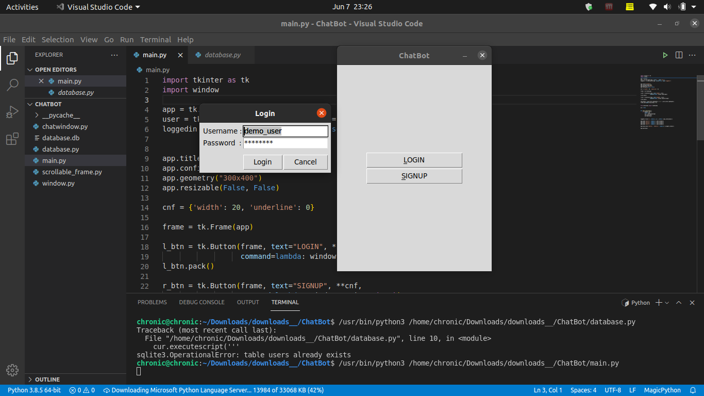
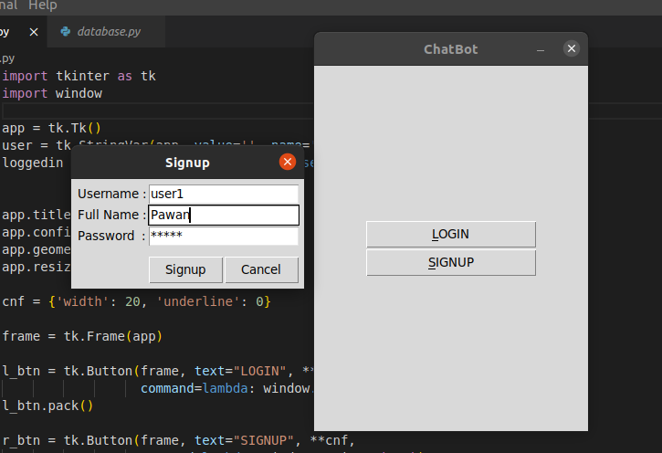
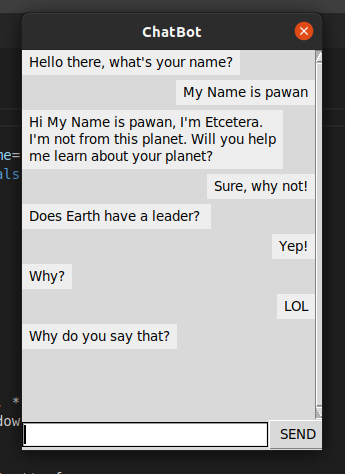

## About

A rule based simple chatbot designed on the motivation of handling customers in a real world, mostly you can't hire a bunch a people to respond to every queries that customer might ask, so we have chatbot for common FAQs.

It looked something like this:

Signup form looks like this:

Chat window looked similar to this:

